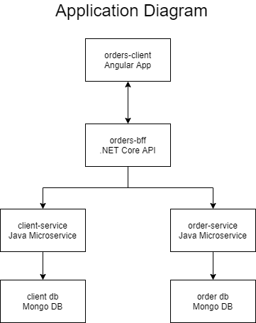
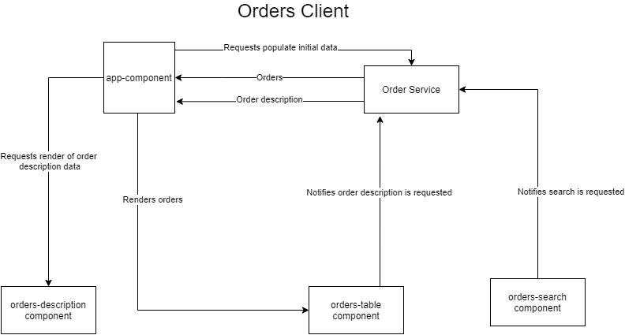

# iFood Fullstack Test

Create a web application that lists Orders according to some criteria. 
The web application has only one page (no need for access control).

Use whatever language, tools and frameworks you feel comfortable to. 

Also, briefly elaborate on your solution, architecture details, choice of patterns, frameworks and components.

Fork this repository and submit your code.

## Requirements

* The page is composed by three elements, according to the ui mockup below:
    * One filter component with a search button.
    * One list of Orders matching the criterias.
    * One Order details modal, displayed when the users clicks an Order.

* The Order data is provided by the micro-service `/order-service`.
* Order is composed by its Id, Restaurant id, Client id, Creation date, Confirmation date and list of Items.
* Item is composed by Description, Quantity and Unit Price.
* The Client data is provided by the micro-service `/client-service`.
* Client is composed by its Id, Name, E-mail and Phone.

## Hints and Constraints

* The diagram below illustrates the high level architecture of the application. 
Feel free to implement whatever solution you judge necessary on the `???` layer.

* You may (perhaps should) change and customize the `/client-service` and `/order-service` micro-services. 
But **MUST NOT** change the [Client](./client-service/src/main/java/com/ifood/demo/client/Client.java) 
and [Order](./order-service/src/main/java/com/ifood/demo/order/Order.java) models. 
* Don't worry about their performance, they are just REST API examples made with 
[spring intializr](https://start.spring.io/) (spring boot + data jpa + data rest). Focus on the `???` layer.
* To install and run the micro-services, user maven commands `mvn package` and `mvn spring-boot:run` on both folders.
The Client will run on port 8081 and the Order on 8082. They are both HATEOAS compliant, 
so you can easily navigate through its endpoints.
* You could use Material UI, Bootstrap or any other toolkit to accelerate your resolution. We will not provide any UI design.

## Non functional requirements

As this web application will be a worldwide success, it must be prepared to be fault tolerant,responsive and resilient. 
In other words, each micro-service will constantly reiceive a POST requests 
(let's say 2/sec for client and 50/sec for order) and your web application will have a lots of users 
active simultaneously (about ~1k).

---

## Solution

For this solution I have decided to use the Back-End For Front-end pattern (BFF) having a layer between the client and the microservices used, giving responsibility for this layer to decide what the client needs to know.

Here's the final diagram for the entire application:

### Client App (orders-client)

The client app is created using Angular 10 which is a technology I am very confortable. Some patterns are worth it mention:

* Reactive programming with RxJs for state management
* Functional programming
* Dependency Injection

Here's a detailed description of the client app flow:

### API (orders-bff)

In the API layer I am using .NET Core, which is the language I use more often for back-end. Here I have used something like:

* Dependency Injection
* Service Pattern
* Liskov Substitution Principle
* Builder Pattern
* AutoMapper to map and convert classes from json and dtos
* OpenAPI Documentation using Swagger

### Java Services

I didn't change much of the architecture done in the java microservices. Basically what I did was add methods to query data from the database in the format I thought it would facilitate to be consumed in the BFF.

### Running the app

In order to run the app, follow the steps to run and install the java microservices described above, then do the following steps to run the BFF and client.

#### Client

1. on `orders-client` run the commands `npm install` and `npm start` to run development mode.
2. navigate to `http://localhost:4200`

    
*Node and npm required to be installed previously.

#### API
1. on `orders-bff/api` run the command `dotnet run` to run development mode.
2. if a new page didn`t open for you, you can access `http://localhost:5000` to access the OpenAPI Documentation of the API.

* .NET Core SDK required to be installed previously.